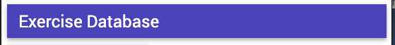
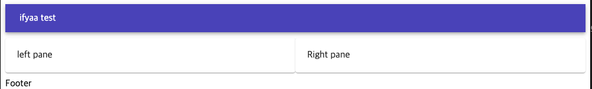
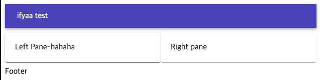
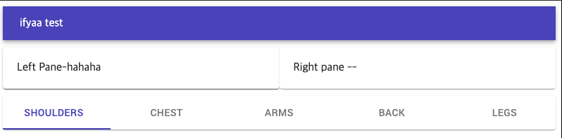
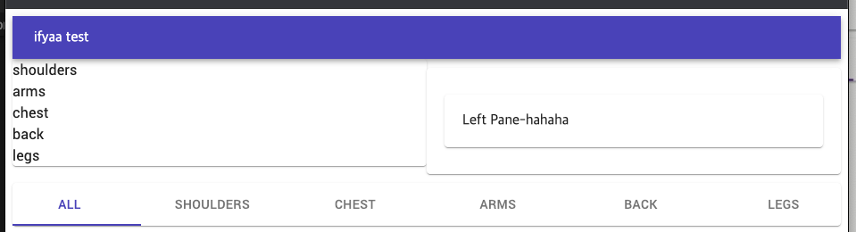
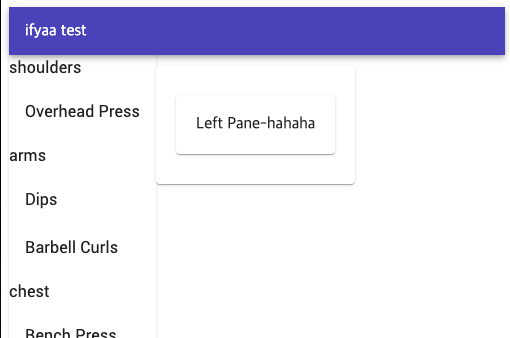

# Appbar

```js
 import AppBar from '@material-ui/core/AppBar';
 import Toolbar from '@material-ui/core/Toolbar';
 import Typography from '@material-ui/core/Typography';

export default porps =>
<AppBar position="static">
  <Toolbar variant="dense">
    <Typography variant="headline" color="inherit">
      Exercises Databases
    </Typography>
  </Toolbar>
</AppBar>
```


# Grid

```js
import React from 'react';
import Grid from '@material-ui/core/Grid';
import Paper from '@material-ui/core/Paper';

const style = {
    Paper: { padding: 20, marginTop: 10, marginBottom: 10 }
}
export default props =>
    <Grid container>
        <Grid item sm>
            <Paper style={style.Paper}>
                left pane
            </Paper>
        </Grid>


        <Grid item sm>
            <Paper style={style.Paper}>
                Right pane
            </Paper>
        </Grid>
    </Grid>
```


#  LeftPane

```js
## index.js
import LeftPane from '../Exercises/LeftPane'

const styles = {
    Paper: { padding: 20, marginTop: 10, marginBottom: 10 }
}
export default props =>
    <Grid container>
        <Grid item sm>
            <Paper styles={styles.Paper}>
                <LeftPane styles={styles}/>
            </Paper>
        </Grid>
        ---

## leftPane.js
import React from 'react'
import Paper from '@material-ui/core/Paper';

export default ({ styles }) =>
    <Paper style={styles.Paper}>
    Left Pane-hahaha
    </Paper>
```



# footer

```js

# contect

import Exercises from '../components/Exercises/index01'
import { muscles, exercises } from '../components/store'

export default class extends Component {
    states = {
        exercises
    }
    render(){
        return <Fragment>
            <Header />

           <Exercises />

            <Footer
             muscles={muscles}
            />
        </Fragment>
    }
}
----------------
# footer.js

import React from 'react'
import Paper from '@material-ui/core/Paper';
import Tabs from '@material-ui/core/Tabs';
import Tab from '@material-ui/core/Tab';

export default ({ muscles }) =>

<Paper>
      <Tabs
      value={0}
        indicatorColor="primary"
        textColor="primary"
        centered
      >
              <Tab label="All" />
          {muscles.map(group =>
              <Tab label={group}/>
          )}

      </Tabs>
    </Paper>
```


# Grid(Body-left)
```js
contect

import React, {Component, Fragment } from 'react'
import Header from '../components/Layout/Header01'
import Footer from '../components/Layout/Footer01'
import Exercises from '../components/Exercises/index01'
import { muscles, exercises } from '../components/store'

export default class extends Component {
    state = {
        exercises
    }

getExercisesByMuscles(){
    return Object.entries(
        this.state.exercises.reduce((exercises, exercise) => {
            const { muscles } = exercise

            exercises[muscles] = exercises[muscles]
            ? [...exercises[muscles], exercise]
            : [exercise]

        return exercises
    }, {})
  )
}

    render(){
        console.log("지랄",this.getExercisesByMuscles())
        const exercises = this.getExercisesByMuscles()

        return <Fragment>
            <Header />

           <Exercises
            exercises={exercises}
           />

            <Footer
             muscles={muscles}
            />
        </Fragment>
    }
}

## index01.js

import React from 'react';
import Grid from '@material-ui/core/Grid';
import Paper from '@material-ui/core/Paper';
import RightPane from '../Exercises/LeftPane';
import Typography from '@material-ui/core/Typography';

const styles = {
    Paper: { padding: 20, marginTop: 10, marginBottom: 10 }
}
export default ({ exercises }) =>
    <Grid container>
        <Grid item sm>
            <Paper styles={styles.Paper}>
            {exercises.map(([group, exercises])=>
                <Typography>
                    {group}
                </Typography>
            )}
            </Paper>
        </Grid>


        <Grid item sm>
            <Paper style={styles.Paper}>
                <RightPane styles={styles}/>
            </Paper>
        </Grid>
    </Grid>


```


# List
```js
index01.js 일부
export default ({ exercises }) =>
    <Grid container>
        <Grid item sm>
            <Paper styles={styles.Paper}>
            {exercises.map(([group, exercises])=>
                <Fragment>
                    <Typography>
                        {group}
                    </Typography>
                <List component="ul">
                    {exercises.map(({ title }) =>
                        <ListItem button>
                            <ListItemText primary={ title } />
                        </ListItem>
                        )}
                </List>
                </Fragment>
            )}
            </Paper>
        </Grid>
```

